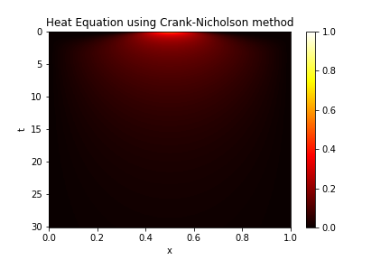

<h3 align="center">Advanced Numerical Analysis HW 4</h3>

  <p align="center">
    Python code for solving two different variations of both the wave and heat equation over the spatial domain $[0,1]$
  </p>
</div>

<!-- GETTING STARTED -->
## Getting Started

The code requires Python to be installed on the machine.

### Prerequisites

The modules required in Python are
* numpy
  ```sh
  pip install numpy
  ```
* scipy
  ```sh
  pip install scipy
  ```
* matplotlib
  ```sh
  pip install matplotlib
  ```

### Installation

1. Simply download HW4.py and run in your favorite Python environment
2. Install required modules

## Wave Equation
We solve the wave equation $u_{tt}=u_{xx}$ with two different sets of boundary conditions over the interval $[0,1]$ and animate the solution through one unit of time. One set of boundary conditions is homogeneous Dirichlet boundary conditions (mirroring) and the other is homogeneous Dirichlet at $0$ and Neumann at $1$ (left-mirroring/right-reflecting). The initial conditions are
<p>
$$
g(x) = \begin{cases} 
10x-4 & .4\leq x\leq.5 \\
6-10x & .5\leq x\leq.6 \\
0 & \text{otherwise} 
\end{cases}
$$
</p>

### Mirroring


### Left Mirroring and Right Reflecting


## Heat Equation
We solve the heat equation $u_t=cu_{xx}$ with two different sets of boundary conditions over the interval $[0,1]$, plot the heat map and the total energy of the system up to the critical time t<sup>*</sup> when the steady state is reached. One set of boundary conditions is homogeneous Dirichlet (absorbing) and the other is homogeneous Neumann (insulating). The steady state was determined by terminating time-stepping when the maximum difference in temperature between the next time-step and the current time-step is $10^{-6}$. The initial conditions are
<p>
$$
g(x) = \begin{cases} 
10x-4 & .4\leq x\leq.5 \\
6-10x & .5\leq x\leq.6 \\
0 & \text{otherwise} 
\end{cases}
$$
</p>

### Absorbing
t<sup>*</sup> = $30.14$

<a href="https://github.com/Shlorki/NumericalHW2">
  
  
</a>

### Insulating
t<sup>*</sup> = $16.82$

<a href="https://github.com/Shlorki/NumericalHW2">
  
  
</a>

<p align="right">(<a href="#readme-top">back to top</a>)</p>
